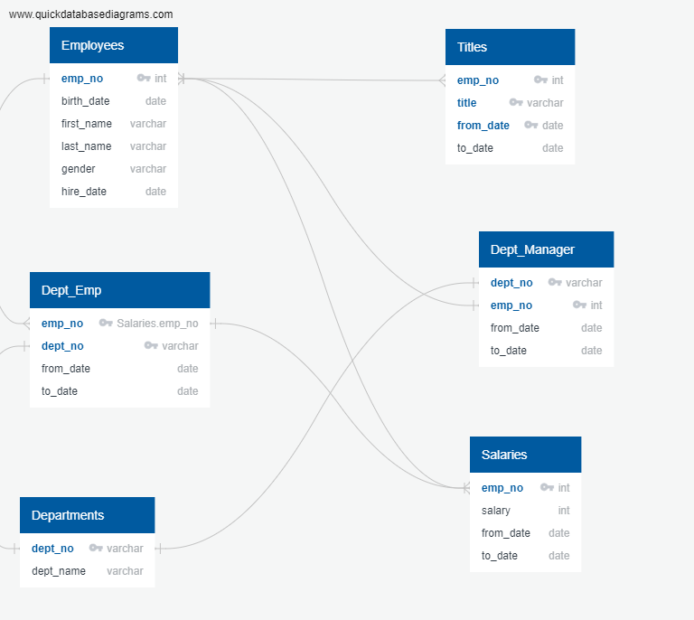
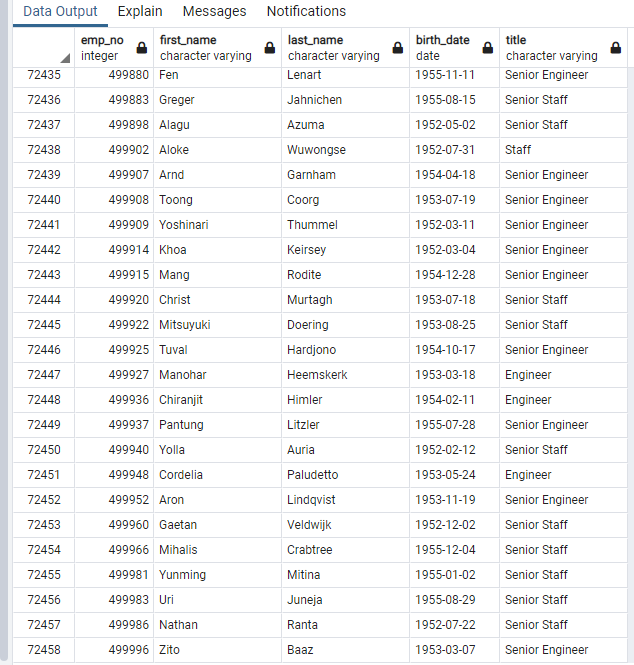
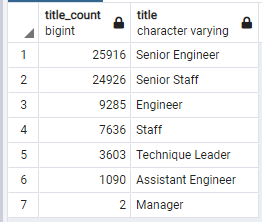
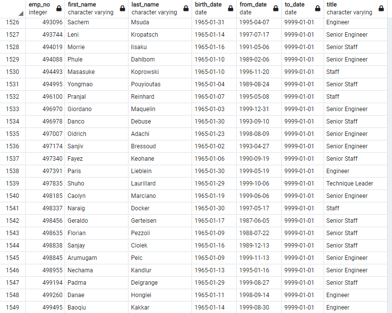
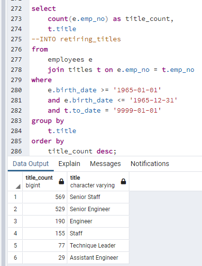
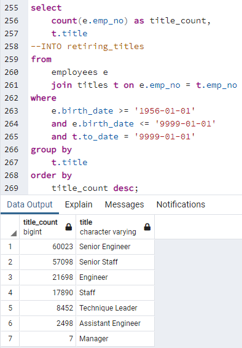

# week7_Pewlett-Hackard-Analysis

## Overview of the analysis:
My project started out with six .csv files containing information on employees, departments, employees in specific departments, titles, department managers, and salaries. I was tasked with creating a data base using these six files. The company is expecting a significant number of employees to be retiring at once; also, being referred to as the "silver tsunami." My analysis will help the company know the number of retiring employees by title and a list of employees eligible for a mentorship program. This way the company can properly prepare for the silver tsunami.

## Results:

* Using the employees' csv, the job titles csv, and the department csv, I can filter that date to show me exactly how many employees are within the age range to retire. Set the filter to show any current employees who were born between the years 1952 and 1955. The number of rows tells me that there are 72,458 employees who are all within a few years of retirement. 

* There's seven job titles that make up the employees that are going to retire. The two highest populated categories are Senior Engineer and Senior staff members. These jobs will easily be the hardest to replace considering there's also a significant number of normal Engineers and Staff employees.

* Another interesting piece of information is that there's only two Managers that will be retiring. Either this company needs more Managers, or most of them are younger and aren't going to retire soon.

* My boss asked me to create a mentorship eligibility table based on current employees born in the year 1965. Since this is only based on people born in the year 1965, there's only 1,549 employees that qualify for this mentorship program.

## Summary:

**How many roles will need to be filled as the "silver tsunami" begins to make an impact?**

We know that there are 72,458 employees that are all within the age range to soon. That's a sizable number. However, when we filtered for this data in our table, we set the parameters for any current employee born between 1952 and 1955. That's a 4-year range, so not all of these people are going to retire at once. If we average it out over a 4-year hiring period, this company is going to have to hire 18,115 new employees each year.

**Are there enough qualified, retirement-ready employees in the departments to mentor the next generation of Pewlett Hackard employees?**

This company is going to have to hire 18,115 new people each year. There's going to be 1,549 employees who are eligible to be mentors. Which means each mentor will have to train a team of 12 new employees each year. That seems realistic actually. However, do we have enough mentors in each department?

This query tells us exactly how many mentors we have in each department. If I divide the title counts of the retiring employees in each department by 4, and then divide that number by the title counts of the mentors in the corresponding departments; I can realistically determine how many new employees the mentors in each department must take on each year. Each department is around that original estimate of teams of 12 for each mentor! Even better, the Assistant Engineer mentors only have to train 9 new employee each year. There aren't any Manager mentors, but that's probably not a problem since there's only 2 Managers retiring.

This new query shows me exactly how many employees we have that aren't retiring soon and how many we have in each department. This confirms that the Managers department isn't that big of a problem. There's 2 Managers that are retiring and 7 that aren't. Even though there aren't any Managers that qualify to be mentors, it would be easy to have a 1:1 mentorship. Also, this table tells me how many employees this company has overall. It's crazy to see that roughly 42% of the company will retire over a 4-year period. This company will survive the silver tsunami, but they must act fast and start planning for it.